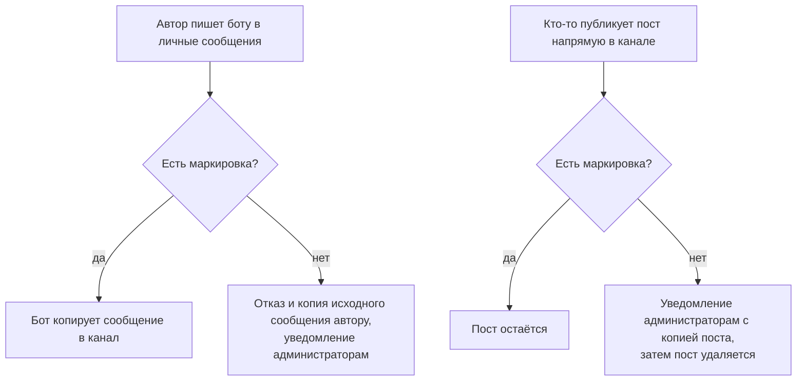

# RF Compliance Bot — маркировка материалов иноагента

[](https://github.com/Faithfinder/rf_compliance_bot/actions/workflows/ci.yml)

Telegram-бот, который не даёт опубликовать в канале материал без обязательной маркировки иностранного агента. Он проверяет каждое сообщение до публикации, а посты, попавшие в канал в обход бота, удаляет и сообщает о них администраторам.

## Зачем это нужно

**Обязанность.** Материалы, произведённые или распространённые иностранным агентом, должны сопровождаться указанием на этот статус — [255-ФЗ «О контроле за деятельностью лиц, находящихся под иностранным влиянием»](https://www.consultant.ru/document/cons_doc_LAW_421788/). Форма указания и правила его размещения установлены [постановлением Правительства РФ от 22.11.2022 № 2108](https://www.consultant.ru/document/cons_doc_LAW_432014/) (действует с 01.12.2022). Типовая формулировка:

```
НАСТОЯЩИЙ МАТЕРИАЛ (ИНФОРМАЦИЯ) ПРОИЗВЕДЕН, РАСПРОСТРАНЕН И (ИЛИ) НАПРАВЛЕН
ИНОСТРАННЫМ АГЕНТОМ «ИМЯ АГЕНТА» ЛИБО КАСАЕТСЯ ДЕЯТЕЛЬНОСТИ ИНОСТРАННОГО
АГЕНТА «ИМЯ АГЕНТА». 18+
```

**Первый пропуск — административная ответственность.** [Статья 19.34 КоАП](https://www.consultant.ru/document/cons_doc_LAW_34661/1216f68ce6aaa76e9eddfeef6e07f3a5b8785f2a/), распространение материалов без указания на статус иноагента: граждане — 30–50 тыс. ₽, должностные лица — 100–300 тыс. ₽, юридические лица — 300–500 тыс. ₽.

**Второй — уголовная, и порог недавно снизили.** [Статья 330.1 УК](https://www.consultant.ru/document/cons_doc_LAW_10699/eced99f183c1f9087f9b4f9e512295fbc846762e/): штраф до 300 тыс. ₽ либо в размере дохода за период до двух лет, обязательные работы до 480 часов, исправительные или принудительные работы до двух лет, **либо лишение свободы на срок до двух лет**. Раньше для возбуждения дела требовались два административных наказания в течение года; [Федеральный закон от 15.10.2025 № 378-ФЗ](https://www.garant.ru/news/1895790/), вступивший в силу 26.10.2025, оставил **одно** — наказания по любой из частей 2–9 статьи 19.34 КоАП достаточно, чтобы следующее такое же нарушение квалифицировалось уже по Уголовному кодексу.

Отсюда и смысл бота: один забытый пост — это не «штраф и забыли», а первая ступень, после которой второй такой же пост становится уголовным делом. Полагаться на внимательность в такой ситуации не стоит, поэтому проверка вынесена в бота и выполняется до публикации.

> ⚠️ **Бот — техническое средство контроля, а не юридическая консультация.** Формулировку маркировки, её применимость к вашему случаю и порядок размещения согласуйте с юристом. Законодательство об иноагентах меняется часто (последнее ужесточение — октябрь 2025), поэтому приведённые здесь нормы и суммы проверяйте на актуальность.

Учтите также, что бот сверяет **только наличие заданной строки в тексте**. Требования постановления № 2108 к оформлению — размер шрифта вдвое больше основного текста, контрастный цвет, размещение в начале материала — он не проверяет и проверить не может.

## Как это работает

Есть два независимых потока.



**1. Публикация через бота.** Автор отправляет сообщение боту в личные сообщения. Если маркировка на месте, бот копирует сообщение в канал (`copyMessage`, форматирование сохраняется) и отвечает подтверждением. Если нет — публикация не происходит, а бот присылает обратно копию исходного сообщения, чтобы его можно было поправить и отправить снова.

**2. Модерация прямых постов.** Если пост появился в канале в обход бота, бот проверяет его так же. Немаркированный пост он сначала пересылает подписанным администраторам, а затем удаляет из канала.

> 💡 Второй поток — страховка, а не основной режим работы. Чтобы им не пользовались как лазейкой, у администраторов-людей стоит **снять право «Публиковать сообщения»**: тогда единственный путь в канал будет через бота. Команда `/info` сама подсказывает это, если видит у вас такое право.

## Быстрый старт

1. Получите токен бота у [@BotFather](https://t.me/botfather).
2. **Добавьте бота в канал администратором** с правами **«Публиковать сообщения»** и **«Удалять сообщения»**. Сделайте это до шага 4: кнопка выбора канала показывает только те каналы, где бот уже состоит.
3. Запустите бота — см. [Установка и запуск](#установка-и-запуск).
4. Напишите боту `/start` в личные сообщения и выберите канал кнопкой. Либо укажите его вручную:
   ```
   /setchannel @mychannel
   /setchannel -1001234567890
   ```
5. Задайте текст маркировки:
   ```
   /set_fa_blurb НАСТОЯЩИЙ МАТЕРИАЛ (ИНФОРМАЦИЯ) ПРОИЗВЕДЕН, РАСПРОСТРАНЕН И (ИЛИ) НАПРАВЛЕН ИНОСТРАННЫМ АГЕНТОМ «ИМЯ АГЕНТА» ЛИБО КАСАЕТСЯ ДЕЯТЕЛЬНОСТИ ИНОСТРАННОГО АГЕНТА «ИМЯ АГЕНТА». 18+
   ```
   **Без этого шага бот бесполезен:** публикация через личные сообщения будет запрещена, а модерация канала — молча отключена.
6. Проверьте `/info` — чек-лист требований должен быть полностью зелёным.
7. Добавьте получателей уведомлений об отклонённых сообщениях: `/notify_add`.
8. Снимите право «Публиковать сообщения» у администраторов-людей.

## Команды

| Команда | Что делает | Кто может |
| --- | --- | --- |
| `/start` | Приветствие; если канал не настроен — сразу предлагает его выбрать | все |
| `/help` | Список доступных команд | все |
| `/info` | Сводка: вы, настроенный канал, чек-лист требований, текущая маркировка, ваши права в канале | все |
| `/setchannel <@channel или ID>` | Настроить канал для публикации. Без аргументов показывает кнопку выбора | все |
| `/removechannel` | Убрать настройку канала | все |
| `/set_fa_blurb [текст]` | **Без аргументов** — показать текущую маркировку. **С аргументами** — задать новую | просмотр — все; изменение — администратор канала с правом управления чатом |
| `/notify_add [user_id]` | Добавить получателя уведомлений. Без аргументов открывает кнопку выбора пользователя | администратор канала с правом управления чатом |
| `/notify_remove [user_id]` | Убрать получателя уведомлений | администратор канала с правом управления чатом |
| `/notify_list` | Показать список получателей | администратор канала |

Что стоит знать отдельно:

- **`/setchannel` и `/removechannel` исчезают**, если задана переменная `FIXED_CHANNEL_ID`: в этом режиме канал один для всех и меняться не может.
- **Настройки привязаны к каналу, а не к пользователю.** Маркировка и список уведомлений общие для всех, кто настроил у себя этот канал.
- **`/notify_add` и `/notify_remove` принимают только числовой ID пользователя** — поиск по `@username` в Telegram Bot API недоступен. Проще пользоваться кнопкой выбора. Добавляемый пользователь должен быть администратором канала.
- **`/dump_db`** — служебная команда, отправляющая владельцу бота весь файл базы данных. Она **не входит в меню и не показывается в `/help`**, регистрируется только при заданном `BOT_OWNER_ID` и работает только для этого пользователя в личных сообщениях.

## Что считается маркированным

Правила сопоставления неочевидны, поэтому стоит их знать:

- Проверяется **наличие заданной строки** в тексте сообщения, либо в подписи к медиа, либо в вопросе опроса.
- Сравнение **чувствительно к регистру и пробелам**. Маркировка должна совпадать с настроенной посимвольно.
- **Форматирование не мешает:** если часть маркировки выделена жирным или курсивом, она всё равно найдётся.
- **Rich-сообщения** Telegram (заголовки, списки, таблицы, цитаты, сворачиваемые блоки, формулы) не содержат обычного текстового поля, поэтому их блоки сначала разворачиваются в плоский текст. Для них сравнение дополнительно повторяется с нормализованными пробелами — структура блоков не сохраняет переносы строк из настроенной маркировки.
- **Альбом** (несколько медиа одним сообщением) считается маркированным, если маркировка есть **хотя бы в одном** сообщении группы: подписи к одной фотографии достаточно.
- Собственные посты бота при модерации пропускаются.

## Уведомления об отклонённых сообщениях

Получателям из `/notify_list` приходит карточка и следом — копия отклонённого сообщения:

```
🚫 Сообщение отклонено

📢 Канал: Название канала (-1001234567890)
👤 Пользователь: Имя (@username)
🆔 ID: 123456789
🕐 Время: 30.07.2026, 18:01

❌ Причина: Отсутствует текст иностранного агента

📝 Отклоненное сообщение:
```

Время указывается по Москве. В потоке «публикация через бота» автор из рассылки исключается — он и так получил отказ. В потоке модерации канала автор, наоборот, получает уведомление в личные сообщения.

Telegram не всегда сообщает ID автора поста в канале — иногда доступна только подпись автора. В этом случае бот всё равно удаляет пост и уведомляет подписанных администраторов, просто не может написать автору лично.

**Бот не может написать первым.** Если получатель уведомлений (или автор поста) ни разу не открывал диалог с ботом или заблокировал его, Telegram отвечает «chat not found», и уведомление до этого человека не доходит — это ограничение Telegram, а не сбой. Поэтому `/notify_add` сразу предупреждает, если добавленному администратору бот писать не может: попросите его открыть чат с ботом и нажать «Старт». Пост при этом всё равно удаляется, а остальные получатели уведомление получают.

`/notify_list` помечает таких получателей значком ⚠️ — это единственный способ заметить тех, кто был добавлен раньше и всё это время ничего не получал. Не путайте с пометкой `(недоступен)`: она означает, что не удалось получить данные пользователя из канала, а не что бот не может ему писать.

## Установка и запуск

Требуется [Bun](https://bun.sh) версии 1.3.14 или выше. Node.js не используется.

```bash
bun install
cp .env.example .env
```

Впишите в `.env` токен из [@BotFather](https://t.me/botfather):

```
TELEGRAM_BOT_TOKEN=ваш_токен
```

Запуск:

```bash
bun run dev     # с автоперезапуском при изменениях
bun run start   # обычный запуск
```

Шага сборки нет — бот запускается прямо из TypeScript. Если `TELEGRAM_BOT_TOKEN` не задан, процесс падает сразу при старте.

## Переменные окружения

| Переменная | Назначение | Обязательна |
| --- | --- | --- |
| `TELEGRAM_BOT_TOKEN` | Токен бота от [@BotFather](https://t.me/botfather). Без него бот не запустится | да |
| `NODE_ENV` | Окружение (`development` / `production`). Передаётся в Sentry как имя окружения | нет |
| `FIXED_CHANNEL_ID` | Жёстко закрепляет один канал за всеми пользователями и убирает команды `/setchannel` и `/removechannel` | нет |
| `BOT_OWNER_ID` | Числовой Telegram ID владельца. Включает `/dump_db`, отправляющую всю базу данных в Telegram. Не задавайте без необходимости | нет |
| `SENTRY_DSN` | DSN для отправки ошибок в Sentry. Если пусто — трекинг ошибок отключён | нет |
| `POSTHOG_API_KEY` | Ключ проекта PostHog (`phc_...`) для продуктовой аналитики. Если пусто — телеметрия отключена целиком. См. [Телеметрия](#телеметрия) | нет |
| `POSTHOG_HOST` | Адрес PostHog. По умолчанию `https://eu.i.posthog.com`. Регион должен совпадать с регионом проекта; для self-hosted укажите свой адрес | нет |
| `POSTHOG_ID_SALT` | Соль для HMAC, которым хешируются Telegram ID пользователей. Значения по умолчанию нет: если задан `POSTHOG_API_KEY`, а соль нет — бот откажется запускаться | да, если задан `POSTHOG_API_KEY` |

`FIXED_CHANNEL_ID` подставляется при создании сессии пользователя, поэтому применяется только к сессиям, созданным **после** установки переменной. Пользователи, уже работавшие с ботом, останутся на своём канале.

## Docker

**Каталог `/app/data` обязан быть примонтированным томом.** В нём лежит база SQLite с настройками каналов и сессиями пользователей; без тома она живёт в изменяемом слое контейнера, и каждый перезапуск молча стирает всю конфигурацию.

```bash
docker build -t rf-compliance-bot .
docker run -v ./data:/app/data -e TELEGRAM_BOT_TOKEN=ваш_токен rf-compliance-bot
```

```yaml
services:
    bot:
        image: rf-compliance-bot
        volumes:
            - ./data:/app/data
        environment:
            - TELEGRAM_BOT_TOKEN=ваш_токен
```

Остальные переменные из таблицы выше передаются так же — через `-e` или блок `environment`. Если не передать `POSTHOG_API_KEY`, телеметрия просто не включится.

## Хранение данных

Единственное хранилище — файл SQLite `data/channels.db` рядом с рабочим каталогом процесса. Две таблицы:

- `channel_settings` — настройки канала: текст маркировки (`foreignAgentBlurb`) и список получателей уведомлений (`notificationUserIds`). Хранятся одним JSON-блобом в колонке `settings`, поэтому новые настройки не требуют миграции схемы.
- `sessions` — состояние диалога с каждым пользователем, в том числе выбранный им канал.

Миграций нет: обе таблицы создаются при старте через `CREATE TABLE IF NOT EXISTS`. Резервная копия — это просто копия файла `channels.db` (или `/dump_db`, если задан `BOT_OWNER_ID`).

## Телеметрия

Бот умеет отправлять продуктовую аналитику в [PostHog](https://posthog.com/) — чтобы владелец видел, доходят ли администраторы до конца настройки и как часто ловятся посты без маркировки.

**По умолчанию телеметрия выключена.** Она включается только если задан `POSTHOG_API_KEY`. Без него все вызовы аналитики превращаются в пустышку: ни одного сетевого запроса не уходит.

Аудитория этого бота — администраторы каналов, попавших под закон об «иностранных агентах». Поэтому данные о людях и данные о каналах обрабатываются **по-разному**.

### Что НЕ отправляется никогда

- текст сообщений, подписи к медиа, вопросы опросов, содержимое rich-текста;
- текст самой маркировки (он содержит наименование агента) — только его длина в символах;
- имена, фамилии, `@username`, подписи авторов постов;
- Telegram ID пользователей в открытом виде;
- ID сообщений;
- IP-адрес и геолокация (`disableGeoip: true` — PostHog не определяет страну по адресу сервера).

### Пользователи: только хеш

Telegram ID пользователя уходит исключительно как HMAC-SHA256 с солью из `POSTHOG_ID_SALT`, усечённый до 128 бит. Соль не покидает процесс, поэтому восстановить ID из хеша нельзя.

**У соли нет значения по умолчанию.** Если задан `POSTHOG_API_KEY`, а `POSTHOG_ID_SALT` — нет, бот не запустится и сообщит, какую переменную нужно задать. Это сделано намеренно: хеш, посоленный чем-то предсказуемым, можно подобрать перебором — ID пользователей Telegram легко перечислить целиком. Молча собирать такие данные хуже, чем не собирать их вовсе. Соль стоит сгенерировать один раз (`openssl rand -hex 32`) и сохранить: при её смене все пользователи в статистике станут новыми.

Если `POSTHOG_API_KEY` не задан, соль не нужна — телеметрия просто выключена.

Это относится и к получателям уведомлений: в аналитику попадает только их количество, а не их ID.

### Каналы: в открытом виде

**ID и названия каналов отправляются как есть.** Канал, который модерирует бот, — публичная информация, а читаемые названия — единственное, что делает аналитику по каналам осмысленной.

### Единственное исключение про текст пользователя

Если сообщение начинается с `/`, записывается имя команды — в том числе нераспознанной, чтобы находить опечатки и понимать, каких команд людям не хватает. **Аргументы команды не записываются никогда**: `/notify_add 123456789` уходит как `notify_add` плюс признак «аргументы были». Имя нераспознанной команды дополнительно проверяется на похожесть на идентификатор (`/123456789`) и в этом случае заменяется на `redacted`. Из обычных, не-командных сообщений не записывается ничего.

### Куда уходят данные

По умолчанию — в EU-облако PostHog (`https://eu.i.posthog.com`). `POSTHOG_HOST` позволяет указать другой регион или собственный self-hosted инстанс, чтобы данные вообще не покидали вашу инфраструктуру.

## Структура проекта

```
rf-compliance-bot/
├── src/
│   ├── index.ts       # Точка входа: подключение, регистрация, корректное завершение
│   ├── utils.ts       # Разбор каналов, проверка требований и прав
│   ├── commands/      # Команды; definitions.ts — единственный источник правды
│   ├── config/        # Экземпляр бота, сессии, Sentry, PostHog, переменные окружения
│   ├── db/            # SQLite и адаптер хранения сессий
│   ├── handlers/      # Обработка сообщений и постов канала, отчёты об ошибках
│   ├── notifications/ # Рассылка уведомлений об отклонённых сообщениях
│   ├── telemetry/     # Продуктовая аналитика: события и хеширование идентификаторов
│   └── utils/         # Сборка альбомов, разворачивание rich-текста
├── tests/             # Тесты
├── .github/workflows/ # CI: линтер, форматирование, тесты
├── .env.example       # Шаблон переменных окружения
├── bunfig.toml        # Настройки тестов Bun
├── tsconfig.json      # Настройки TypeScript
├── eslint.config.js   # Настройки ESLint
└── .prettierrc        # Настройки Prettier
```

## Разработка

```bash
bun run dev            # запуск с автоперезапуском
bun test               # тесты (покрытие включено в bunfig.toml)
bun run lint           # ESLint
bun run format         # Prettier
```

Подробнее — в [CONTRIBUTING.md](CONTRIBUTING.md).

## Лицензия

[MIT](LICENSE).
