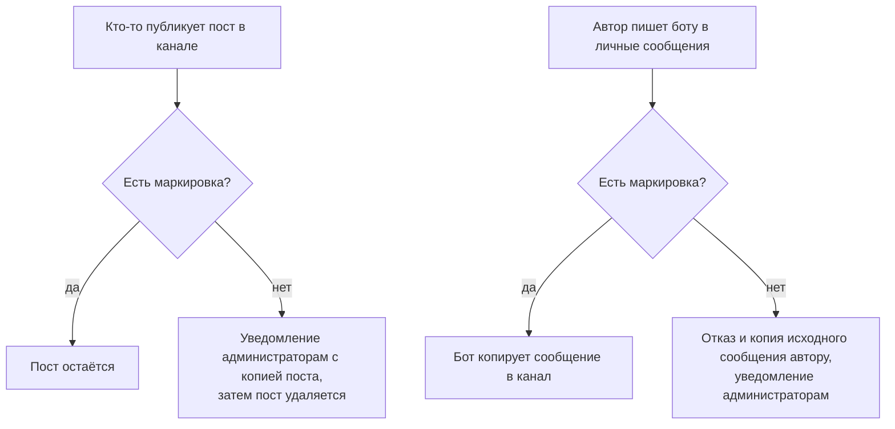

# RF Compliance Bot — маркировка материалов иноагента

[](https://github.com/Faithfinder/rf_compliance_bot/actions/workflows/ci.yml)

Telegram-бот, который не даёт остаться в канале материалу без обязательной маркировки иностранного агента. Он проверяет каждый пост и удаляет немаркированный, сообщая о нём администраторам. По желанию можно публиковать через самого бота — тогда проверка происходит до публикации.

## Зачем это нужно

Материалы, произведённые или распространённые иностранным агентом, должны сопровождаться указанием на этот статус — [255-ФЗ](https://www.consultant.ru/document/cons_doc_LAW_421788/). Форма указания установлена [постановлением Правительства РФ от 22.11.2022 № 2108](https://www.consultant.ru/document/cons_doc_LAW_432014/). Типовая формулировка:

```
НАСТОЯЩИЙ МАТЕРИАЛ (ИНФОРМАЦИЯ) ПРОИЗВЕДЕН, РАСПРОСТРАНЕН И (ИЛИ) НАПРАВЛЕН
ИНОСТРАННЫМ АГЕНТОМ «ИМЯ АГЕНТА» ЛИБО КАСАЕТСЯ ДЕЯТЕЛЬНОСТИ ИНОСТРАННОГО
АГЕНТА «ИМЯ АГЕНТА». 18+
```

Первый пропуск — административная ответственность: [статья 19.34 КоАП](https://www.consultant.ru/document/cons_doc_LAW_34661/1216f68ce6aaa76e9eddfeef6e07f3a5b8785f2a/), от 30 тыс. ₽ для граждан до 500 тыс. ₽ для юридических лиц. Второй — уголовная: [статья 330.1 УК](https://www.consultant.ru/document/cons_doc_LAW_10699/eced99f183c1f9087f9b4f9e512295fbc846762e/), вплоть до лишения свободы на два года. Порог недавно снизили: раньше для возбуждения дела требовались два административных наказания за год, но [378-ФЗ от 15.10.2025](https://www.garant.ru/news/1895790/) оставил **одно**.

Отсюда и смысл бота: один забытый пост — это первая ступень, после которой второй такой же становится уголовным делом. Полагаться на внимательность не стоит, поэтому проверка вынесена в бота.

> ⚠️ **Бот — техническое средство контроля, а не юридическая консультация.** Формулировку маркировки, её применимость к вашему случаю и порядок размещения согласуйте с юристом; законодательство меняется часто, поэтому приведённые нормы и суммы проверяйте на актуальность. Бот сверяет **только наличие заданной строки в тексте** — требования постановления № 2108 к оформлению (размер и цвет шрифта, размещение в начале материала) он не проверяет и проверить не может.

## Как это работает



**1. Модерация канала — основной режим.** Публикуйте как обычно. Каждый пост проверяется; немаркированный сначала пересылается автору и подписанным администраторам, затем удаляется. Ничего настраивать в процессе работы не нужно — режим включается сам, как только у бота есть право удалять сообщения и задан текст маркировки.

**2. Публикация через бота — строгий режим, по желанию.** Автор отправляет пост боту в личные сообщения. Маркированный уходит в канал через `copyMessage`, так что форматирование сохраняется. Немаркированный не публикуется вовсе, а бот присылает обратно копию исходного сообщения, чтобы его можно было поправить и отправить снова.

### Чем режимы отличаются

Это размен удобства на надёжность: **модерация удобнее, но пост успевает выйти; публикация через бота неудобнее, но не даёт ему выйти вовсе.**

| | Модерация канала | Публикация через бота |
| --- | --- | --- |
| Удобство | публикуете как обычно, прямо из Telegram | пишете боту в личные сообщения, форматирование ограничено возможностями `copyMessage` |
| Когда проверяет | после публикации | до публикации |
| Пост успевает увидеть аудитория | да — подписчики получают уведомление, пост живёт до удаления секунды или минуты | нет |
| Если бот недоступен | немаркированный пост **остаётся в канале, и об этом никто не узнает** | пост **не выходит вообще**, автор замечает это сразу |

Последняя строка — главная. Модерация отказывает «в открытую» и молча: сбой бота выглядит ровно как его отсутствие, а немаркированный пост тем временем висит в канале. Публикация через бота отказывает «в закрытую» и заметно: пост не вышел — вы это видите.

Поэтому выбор простой. Если публиковать через личные сообщения приемлемо — второй режим строже, и лучше пользоваться им. Если нет — модерация закрывает большую часть риска и не меняет вашу привычную работу.

Режимы не исключают друг друга и работают одновременно.

## Быстрый старт

Этого достаточно, чтобы заработала модерация канала.

1. Получите токен бота у [@BotFather](https://t.me/botfather).
2. **Добавьте бота в канал администратором** с правом **«Удалять сообщения»**. Сделайте это до шага 4: кнопка выбора канала показывает только те каналы, где бот уже состоит.
3. Запустите бота — см. [Установка и запуск](#установка-и-запуск).
4. Напишите боту `/start` в личные сообщения и выберите канал кнопкой. Либо укажите его вручную: `/setchannel @mychannel` или `/setchannel -1001234567890`. Сама модерация к вам не привязана, но выбрать канал нужно: иначе боту некуда записать текст маркировки.
5. Задайте текст маркировки командой `/set_fa_blurb <текст>`. **Без этого шага бот бесполезен:** он не проверяет ничего, пока текст не задан.
6. Проверьте `/info` — модерация канала должна быть отмечена как работающая.

Рекомендуется, но не обязательно: `/notify_add` — получатели уведомлений видят копию каждого удалённого поста. Без них модерация работает точно так же, просто удаляет молча.

## Публикация через бота

Дополнительный режим для тех, кому нужна проверка **до** публикации, — со всеми оговорками из раздела [Чем режимы отличаются](#чем-режимы-отличаются). Поверх быстрого старта понадобится:

1. Выдать боту право **«Публиковать сообщения»** в канале.
2. Выдать автору право **«Редактировать сообщения»** в канале. Это не то же самое, что «Публиковать сообщения»: первое разрешает публиковать через бота, второе — постить напрямую.
3. Отправить боту любой пост в личные сообщения, чтобы проверить.

> 💡 Чтобы через бота шло всё, **снимите право «Публиковать сообщения» у администраторов-людей**: тогда единственным путём в канал останется проверка до публикации, а модерация останется страховкой на случай, если право кому-то вернут. Команда `/info` подсказывает это, когда публикация через бота уже настроена.

## Команды

| Команда | Что делает | Кто может |
| --- | --- | --- |
| `/start` | Как работает бот и что осталось настроить; если канал не выбран — сразу предлагает его выбрать | все |
| `/help` | Список команд по группам и краткое описание обоих режимов | все |
| `/info` | Сводка: вы, выбранный канал, готовность каждого режима по отдельности, текущая маркировка, ваши права в канале | все |
| `/setchannel <@channel или ID>` | Выбрать канал, за которым следит бот. Без аргументов показывает кнопку выбора | все |
| `/removechannel` | Убрать настройку канала | все |
| `/set_fa_blurb [текст]` | **Без аргументов** — показать текущую маркировку. **С аргументами** — задать новую | просмотр — все; изменение — администратор канала с правом управления чатом |
| `/notify_add [user_id]` | Добавить получателя уведомлений. Без аргументов открывает кнопку выбора пользователя | администратор канала с правом управления чатом |
| `/notify_remove [user_id]` | Убрать получателя уведомлений | администратор канала с правом управления чатом |
| `/notify_list` | Показать список получателей | администратор канала |

Что стоит знать отдельно:

- **`/setchannel` и `/removechannel` исчезают**, если задана переменная `FIXED_CHANNEL_ID`: в этом режиме канал один для всех и меняться не может.
- **Настройки привязаны к каналу, а не к пользователю.** Маркировка и список уведомлений общие для всех, кто настроил у себя этот канал. Из этого же следует, что модерация продолжает работать после `/removechannel`: она смотрит на настройки канала, а не на вашу сессию. Чтобы выключить её, уберите бота из администраторов канала.
- **`/notify_add` и `/notify_remove` принимают только числовой ID пользователя** — поиск по `@username` в Telegram Bot API недоступен. Проще пользоваться кнопкой выбора. Добавляемый пользователь должен быть администратором канала.
- **`/dump_db`** — служебная команда, отправляющая владельцу бота весь файл базы данных. Она **не входит в меню и не показывается в `/help`**, регистрируется только при заданном `BOT_OWNER_ID` и работает только для этого пользователя в личных сообщениях.

## Что считается маркированным

- Проверяется **наличие заданной строки** в тексте сообщения, либо в подписи к медиа, либо в вопросе опроса.
- Сравнение **чувствительно к регистру и пробелам**: маркировка должна совпадать с настроенной посимвольно.
- **Форматирование не мешает:** если часть маркировки выделена жирным или курсивом, она всё равно найдётся.
- **Rich-сообщения** Telegram (заголовки, списки, таблицы, цитаты, сворачиваемые блоки, формулы) не содержат обычного текстового поля, поэтому их блоки сначала разворачиваются в плоский текст. Для них сравнение дополнительно повторяется с нормализованными пробелами — структура блоков не сохраняет переносы строк из настроенной маркировки.
- **Альбом** (несколько медиа одним сообщением) считается маркированным, если маркировка есть **хотя бы в одном** сообщении группы: подписи к одной фотографии достаточно.
- Собственные посты бота при модерации пропускаются.

## Уведомления об отклонённых сообщениях

Получателям из `/notify_list` приходит карточка (канал, пользователь, его ID, время по Москве, причина) и следом — копия отклонённого сообщения.

При модерации канала автор получает уведомление в личные сообщения — если Telegram сообщил его ID. Иногда доступна только подпись автора; тогда бот всё равно удаляет пост и уведомляет администраторов, просто не может написать автору лично. При публикации через бота автор из рассылки, наоборот, исключается: он и так получил отказ.

Список получателей необязателен. Пустой список не мешает модерации: посты удаляются как обычно, просто копия никому не уходит.

## Установка и запуск

Требуется [Bun](https://bun.sh) 1.3.14 или выше. Node.js не используется, шага сборки нет — бот запускается прямо из TypeScript.

```bash
bun install
cp .env.example .env   # впишите TELEGRAM_BOT_TOKEN из @BotFather
bun run dev            # с автоперезапуском; для обычного запуска — bun run start
```

Если `TELEGRAM_BOT_TOKEN` не задан, процесс падает сразу при старте.

## Переменные окружения

| Переменная | Назначение | Обязательна |
| --- | --- | --- |
| `TELEGRAM_BOT_TOKEN` | Токен бота от [@BotFather](https://t.me/botfather). Без него бот не запустится | да |
| `NODE_ENV` | Окружение (`development` / `production`). Передаётся в Sentry как имя окружения | нет |
| `FIXED_CHANNEL_ID` | Жёстко закрепляет один канал за всеми пользователями и убирает команды `/setchannel` и `/removechannel` | нет |
| `BOT_OWNER_ID` | Числовой Telegram ID владельца. Включает `/dump_db`, отправляющую всю базу данных в Telegram. Не задавайте без необходимости | нет |
| `SENTRY_DSN` | DSN для отправки ошибок в Sentry. Если пусто — трекинг ошибок отключён | нет |
| `POSTHOG_API_KEY` | Ключ проекта PostHog (`phc_...`) для продуктовой аналитики. Если пусто — телеметрия отключена целиком. См. [Телеметрия](#телеметрия) | нет |
| `POSTHOG_HOST` | Адрес PostHog. По умолчанию `https://eu.i.posthog.com`. Регион должен совпадать с регионом проекта; для self-hosted укажите свой адрес | нет |
| `POSTHOG_ID_SALT` | Соль для HMAC, которым хешируются Telegram ID пользователей. Значения по умолчанию нет | да, если задан `POSTHOG_API_KEY` |

`FIXED_CHANNEL_ID` подставляется при создании сессии пользователя, поэтому применяется только к сессиям, созданным **после** установки переменной. Пользователи, уже работавшие с ботом, останутся на своём канале.

## Docker

**Каталог `/app/data` обязан быть примонтированным томом.** В нём лежит база SQLite с настройками каналов и сессиями пользователей; без тома она живёт в изменяемом слое контейнера, и каждый перезапуск молча стирает всю конфигурацию.

```bash
docker build -t rf-compliance-bot .
docker run -v ./data:/app/data -e TELEGRAM_BOT_TOKEN=ваш_токен rf-compliance-bot
```

Остальные переменные из таблицы выше передаются так же — через `-e` или блок `environment` в compose.

## Хранение данных

Единственное хранилище — файл SQLite `data/channels.db` рядом с рабочим каталогом процесса. Две таблицы: `channel_settings` (текст маркировки и список получателей уведомлений, одним JSON-блобом в колонке `settings`, поэтому новые настройки не требуют миграции схемы) и `sessions` (состояние диалога с каждым пользователем, включая выбранный канал).

Миграций нет: обе таблицы создаются при старте через `CREATE TABLE IF NOT EXISTS`. Резервная копия — это просто копия файла `channels.db` (или `/dump_db`, если задан `BOT_OWNER_ID`).

## Телеметрия

Бот умеет отправлять продуктовую аналитику в [PostHog](https://posthog.com/) — какие посты проходят проверку, а какие удаляются, и доходят ли администраторы до конца настройки. **По умолчанию телеметрия выключена:** без `POSTHOG_API_KEY` ни одного сетевого запроса не уходит.

**Никогда не отправляются:**

- текст сообщений, подписи к медиа, вопросы опросов, содержимое rich-текста;
- текст самой маркировки (он содержит наименование агента) — только его длина в символах;
- имена, фамилии, `@username`, подписи авторов постов;
- Telegram ID пользователей в открытом виде и ID сообщений;
- IP-адрес и геолокация (`disableGeoip: true`).

**Данные о людях и данные о каналах обрабатываются по-разному.** Telegram ID пользователя уходит только как HMAC-SHA256 с солью из `POSTHOG_ID_SALT`; соль не покидает процесс, значения по умолчанию у неё нет, и при заданном `POSTHOG_API_KEY` без соли бот не запустится — хеш с предсказуемой солью подбирается перебором. Сгенерируйте её один раз (`openssl rand -hex 32`) и сохраните: при смене соли все пользователи в статистике станут новыми. ID и названия каналов, наоборот, отправляются как есть — канал, который модерирует бот, публичен.

**Единственное исключение про текст пользователя** — имя команды, если сообщение начинается с `/`. Аргументы не записываются никогда: `/notify_add 123456789` уходит как `notify_add` плюс признак «аргументы были».

По умолчанию данные уходят в EU-облако PostHog. `POSTHOG_HOST` позволяет указать другой регион или собственный self-hosted инстанс, чтобы они вообще не покидали вашу инфраструктуру.

## Разработка

```bash
bun test               # тесты (покрытие включено в bunfig.toml)
bun run lint           # ESLint
bun run format         # Prettier
```

Полный список скриптов, соглашения по коду и правила для pull request — в [CONTRIBUTING.md](CONTRIBUTING.md).

## Лицензия

[MIT](LICENSE).
